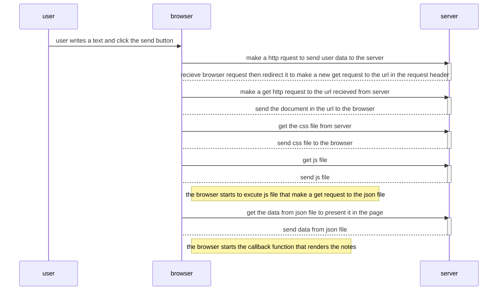

```mermaid
sequenceDiagram
participant user
participant browser
participant server
user ->> browser: user writes a text and click the send button
browser ->> server: make a http rquest to send user data to the server 
activate server
server --> browser: recieve browser request then redirect it to make a new get request to the url in the request header
deactivate server 
browser ->> server: make a get http request to the url recieved from server 
activate server 
server --> browser: send the document in the url to the browser 
deactivate server 
browser ->> server: get the css file from server 
activate server 
server --> browser: send css file to the browser 
deactivate server 
browser ->> server: get js file 
activate server 
server --> browser: send js file
deactivate server
Note right of browser: the browser starts to excute js file that make a get request to the json file 
browser ->> server: get the data from json file to present it in the page 
activate server 
server --> browser: send data from json file 
deactivate server 
Note right of browser: the browser starts the callback function that renders the notes 
```
