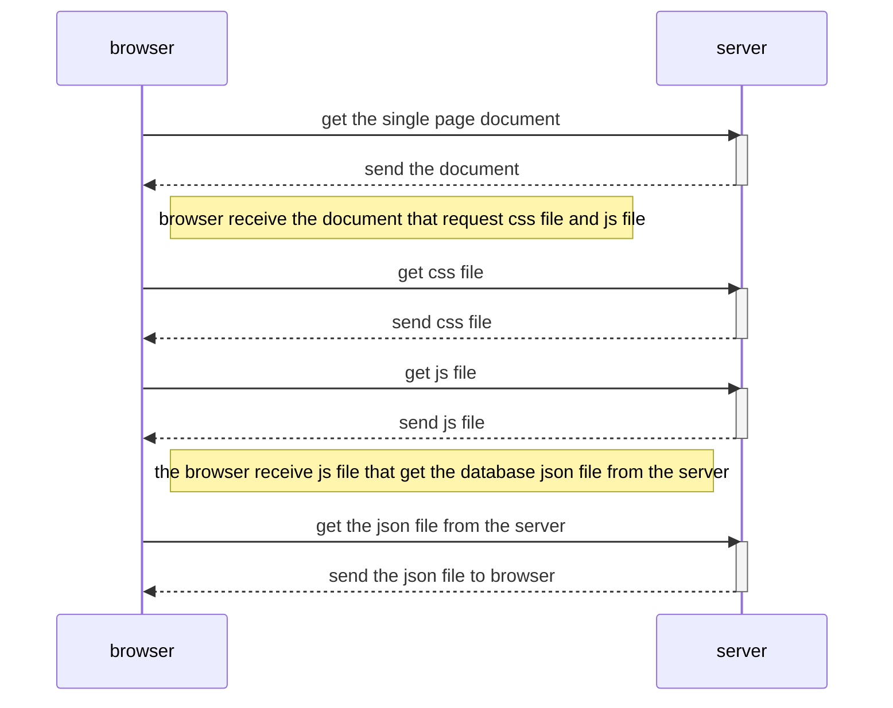

```mermaid
sequenceDiagram
participant browser
participant server
browser ->> server: get the single page document
activate server 
server -->> browser: send the document 
deactivate server 
Note right of browser: browser receive the document that request css file and js file 
browser ->> server: get css file 
activate server 
server -->> browser: send css file 
deactivate server 
browser ->> server: get js file 
activate server 
server -->> browser: send js file 
deactivate server 
Note right of browser: the browser receive js file that get the database json file from the server 
browser ->> server: get the json file from the server 
activate server 
server -->> browser: send the json file to browser 
deactivate server 
```
