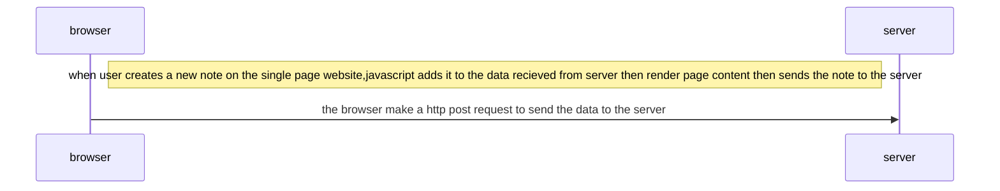

```mermaid
sequenceDiagram
participant browser 
participant server 
Note right of browser: when user creates a new note on the single page website,javascript adds it to the data recieved from server then render page content then sends the note to the server 
browser ->> server: the browser make a http post request to send the data to the server 
```
